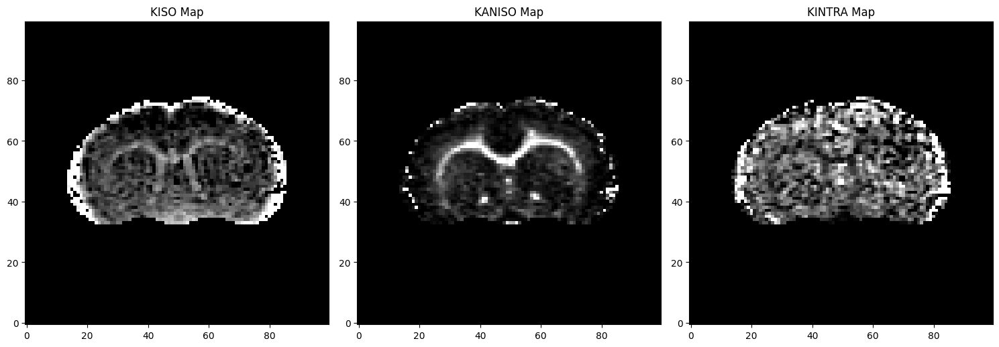

# Google Summer of Code Final Work Product
* **Name:** Shilpi Prasad
* **Organisation:** Python Software Foundation
* **Sub-Organisation:** DIPY
* **Project:** [DIPY - Implement a Correlation Tensor Magnetic Resonance Imaging Module](https://github.com/dipy/dipy/wiki/Google-Summer-of-Code-2023)

## NOTE
One point to note is that this was a research project. And because of the intertwined nature of the objectives and the interconnected dependencies it wasn't feasible to fragment the contributions into smaller PRs. As such, all files and changes were consolidated into a single comprehensive PR.  This was done to maintain the integrity and coherence of the research project. Also, at the moment the PR is completed with unit tests executed successfully, and comprehensive documentation completed. While my mentor has reviewed the code, we're now awaiting final feedback from two external reviewers to ensure utmost precision and quality. Consequently, the same PR link will appear against multiple objectives, as it encompasses the entirety of the updates.

## Proposed Objectives
* Creation of CTI Design Matrix
* Generating CTI Simulation
* Creation of CTI Module
* Generation of Tests
* Creating a tutorial for CTI

## Objectives Completed
* ### Creation of CTI Design Matrix 

  CTI Design Matrix consists of 42 elements, 6 Diffusion Tensor elements, 15 Kurtosis Tensor elements, and 21 Covariance Tensor elements arranged in the given order. 
  The design matrix exists in the dipy/core/utils.py file. 

  *Pull Requests:*
  * **CTI design matrix** https://github.com/dipy/dipy/pull/2816

* ### Creation of CTI Simulation

  The ``cti_simulation`` is a foundational component set up at the start of the ``test_cti.py`` file. It serves as the primary mechanism to execute the test runs, ensuring that each test is evaluated under consistent and predefined conditions.

  *Pull Requests:*
  * **CTI Simulation** https://github.com/dipy/dipy/pull/2816

* ### Creation of CTI Module

  CTI is an advanced diffusion MRI technique that focuses on capturing the correlation between diffusion signals in different directions.
  CTI provides improved accuracy in characterizing tissue microstructure, enhanced detection of crossing fibers, and better mapping of complex white matter connections.
  CTI specifically addresses the challenges associated with crossing fibers, which can confound interpretation and analysis.
  CTI also provides more in-depth information about the microscopic anisotropy of cells, whether they are aligned or crossing.
  Also, unlike DKI, CTI differentiates between different sources of kurtosis, including microscopic anisotropy.
  The total kurtosis in CTI is composed of contributions from isotropic kurtosis (Kiso), anisotropic kurtosis (Kaniso), and microscopic anisotropy (microK).

  *Pull Requests:*
  * **CTI module** https://github.com/dipy/dipy/pull/2816

* ### CTI Tests 

  In our case CTI testing involved a more rigorous approach of comparing the output with predefined ground truth values to ensure not just functionality, but also the accuracy and validity of the results. Moreover, our testing approach was intertwined with the development process itself. As individual functions were being developed and completed, tests were concurrently written and executed for them. 

  *Pull Requests:*
  * **test_cti.py:**  https://github.com/dipy/dipy/pull/2816

* ### Creation of CTI Tutorial 

  ``CTI Tutorial`` is designed to provide a comprehensive overview of the CTI module's functionality. It delves into demonstrating how to effectively utilize the model and offers guidance on integrating real-world data with our system.
  It is under dipy/doc/examples/reconst_cti.py file. This .py file would be later regenerated by sphinx.

  *Pull Requests:*
  * **reconst_cti.py:** https://github.com/dipy/dipy/pull/2816
* ### Generation of Kurtosis Sources Maps 
  
  One significant advantage of the CTI module over other modules is its ability to distinguish between various sources of kurtosis, including microscopic anisotropy. The overall kurtosis in CTI comprises contributions from isotropic kurtosis (Kiso), anisotropic kurtosis (Kaniso), and microscopic anisotropy (microK).
  Below is the map which represents the different sources of kurtosis for the brain of a rat. 
  

## Objectives in Progress

* ### Tutorial improvement.

  I intend on revising the documentation to make the tutorial easier to follow. Also, at the moment, the data used in the tutorial is taken from my local computer. I intend on creating a fetcher using which a person can download the data on their own local system and run it on the model. 

  *Pull Requests:*
  * **Current File:** https://github.com/dipy/dipy/pull/2816

## Other Objectives
* ### Generate QTI Simulation

  This needs to be done as at the moment, no simulation exists for QTI. 

  *Pull Requests:*
  * **QTI Simulation tutorial:** https://github.com/dipy/dipy/pull/2830

* ### Get Reviewers 
  At present, the merging of my PR is on hold. We're actively seeking a pair of reviewers who can conduct a thorough examination of the entire codebase and provide their expert feedback. This meticulous review process is pivotal to ensure the code's robustness and reliability.

* ### GSoC weekly Blogs

  Weekly blogs were added for DIPY's Website.

  *Pull Requests:*

## Timeline
| Date                 | Description  | Blog Link          |
|----------------------|--------------|--------------------|
|Week 0 & 1 (29-05-2023)|Community Bonding and Week1 Insights|[Weekly Check-in #0 & #1](https://blogs.python-gsoc.org/en/shilpi06s-blog/community-bonding-week1-insights/) |
|Week 2 (05-06-2023)|Signal Creation & Paper Research|[Weekly Check-in #2](https://blogs.python-gsoc.org/en/shilpi06s-blog/week2-blog-5thjune/)|
|Week 3 (13-06-2023)|CTI Simulation and QTI tutorial|[Weekly Check-in #3](https://blogs.python-gsoc.org/en/shilpi06s-blog/weekly-blog-post-3-11/)|
|Week 4 (19-06-2020)|Re-Engineering Simulation Code with the QTI Model|[Weekly Check-in #4](https://blogs.python-gsoc.org/en/shilpi06s-blog/weekly-blog-post-4-13/)|
|Week 5 (26-06-2020)|Design Matrix Implementation and Coding with PEP8|[Weekly Check-in #5](https://blogs.python-gsoc.org/en/shilpi06s-blog/week-5-jun-27th-2023/)|
|Week 6 (06-07-2020)|Creating signal_predict Method: Testing Signal Generation|[Weekly Check-in #6](https://blogs.python-gsoc.org/en/shilpi06s-blog/week-6-jul-06th-2023/)|
|Week 7 (12-07-2020)|Modifying Test Signal Generation|[Weekly Check-in #8](https://blogs.python-gsoc.org/en/shilpi06s-blog/week-7-jul-12th-2023/)|
|Week 8 & 9 (27-07-2020)|Generating Fit Functions|[Weekly Check-in #9](https://blogs.python-gsoc.org/en/shilpi06s-blog/week-9-jul-27th-2023/)|
|Week 10 (31-07-2020)|Generating Tests|[Weekly Check-in #10](https://blogs.python-gsoc.org/en/shilpi06s-blog/week-10-aug-1st-2023/)|
|Week 11 (08-08-2020)|Making the Tests Work|[Weekly Check-in #11](https://blogs.python-gsoc.org/en/shilpi06s-blog/week-11-aug-8th-2023/)|
|Week 12 (15-08-2020)|Making Test Functions more Robust|[Weekly Check-in #12](https://blogs.python-gsoc.org/en/shilpi06s-blog/week-12-aug-15th-2023/)|
|Week 13 (22-08-2020)|Writing Tests & Making Documentation|[Weekly Check-in #13](https://blogs.python-gsoc.org/en/shilpi06s-blog/week-13-august-22nd-2023/)|

Detailed weekly tasks and work done can be found [here](https://blogs.python-gsoc.org/en/shilpi06s-blog/).
